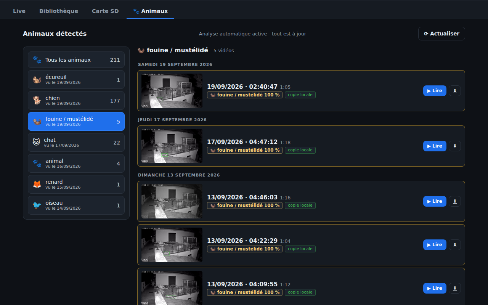
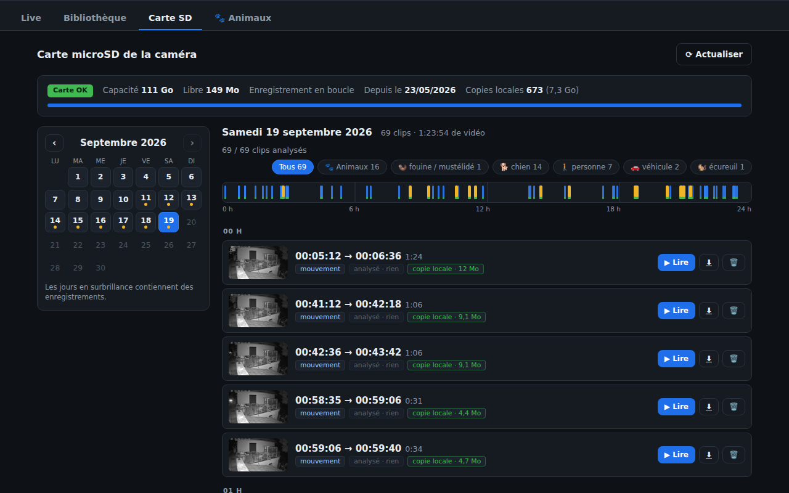
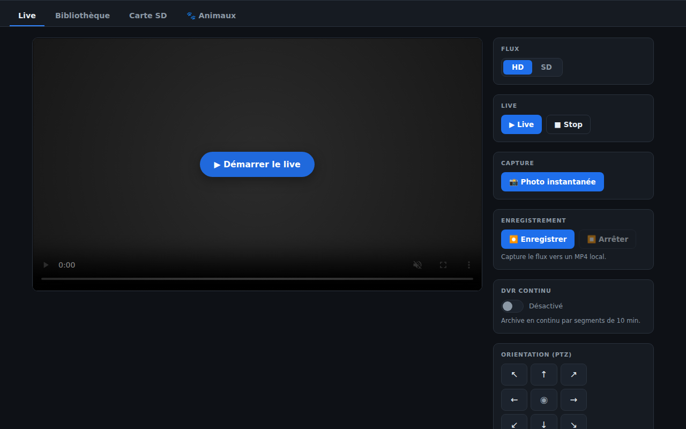

# tapo-web

A small self-hosted web app for a TP-Link Tapo camera. Live view, a browser for the videos
sitting on the camera's SD card, and automatic animal detection so I can finally find out who
eats the cat food at 3 am.

Spoiler: it's a stone marten.


Everything runs on my own machine and talks to the camera over the LAN. No cloud, no
subscription, nothing leaves the house.

## What it does

**Animals tab.** Every clip the camera records gets downloaded and analysed in the background.
On the left you pick a species, on the right you get all the matching videos, across all days,
with a preview frame where the animal is boxed. Clicking a tag starts the video right where the
animal shows up. Videos are kept on disk for good, so they are still there long after the SD
card has looped over them.



**SD card tab.** Calendar of the days that have recordings, a 24 h timeline, one row per clip
with the camera's own thumbnail. Play starts after a second or two while the rest of the clip is
still coming in (the camera delivers at roughly 10x realtime). Download gives you a normal MP4,
original H.264, no re-encode.



**Live tab.** Live stream in the browser (HLS), HD/SD switch, snapshot, record on demand,
continuous DVR in 10 minute chunks, and pan/tilt on motorised models.



The UI is in French because that's what we speak at home. Should be easy enough to follow, and
translating it is a small job if someone wants it.

## Why this exists

After a firmware update my C510W (fw 1.3.4) stopped answering pytapo, python-kasa and the Home
Assistant integration: `error_code -40211` on every login. The camera had moved to a new local
protocol (SPAKE2+ handshake, then an AES-CCM channel) that nobody had documented. I worked it
out and wrote it all down here: **[tapo-v4-protocol](https://github.com/freeKC/tapo-v4-protocol)**.
This app is built on top of that.

## Animal detection

It uses [DeepFaune](https://www.deepfaune.cnrs.fr) (CNRS), a model trained on European wildlife
camera traps: fox, marten and other mustelids, badger, hedgehog, cat, dog, roe deer, wild boar,
birds and so on. A YOLO detector finds the animal, a ViT classifier names it. It copes well with
infrared night footage, which is when all the interesting visitors come by.

A few things I had to add to make it usable on a garden camera:

* frames are sampled densely in the first seconds of a clip, because the animal that triggered
  the recording is often gone after three seconds
* anything that sits in exactly the same spot frame after frame gets dropped (a dark corner of
  my driveway was a "bird" every single night), unless the classifier is very sure, so a cat
  sitting still on the wall is still a cat
* species that make no sense here (the model once saw a cow on my terrace) fall back to a
  plain "animal" tag

On an old GTX 1050 a one minute clip takes 15 to 25 seconds. It also runs on CPU, just slower.
The model lives in its own process and its own virtualenv, and shuts down when there is nothing
to do, so the web app itself stays light.

## Install

You need Python 3.12, ffmpeg, and [uv](https://github.com/astral-sh/uv) (or adapt the commands to pip).

```bash
git clone https://github.com/freeKC/tapo-web && cd tapo-web
uv venv .venv && uv pip install --python .venv/bin/python -r requirements.txt
./start.sh            # then open http://localhost:8088
```

On first start the app asks for the camera credentials in the browser (gear icon, top right):

* the **camera account** you created in the Tapo app (Advanced settings, Camera account). Used for the live stream and ONVIF.
* your **TP-Link account password**. The camera's local control API and its media port want that one. It is only ever sent to your camera.

They are stored in a local `.env` file readable by you only. That file is in `.gitignore`.
Settings can only be changed from the machine that runs the app.

For the animal detection (optional, about 8 GB with PyTorch and the model weights):

```bash
./ml/setup.sh
```

Then it just runs. New clips are picked up every 10 minutes, and the whole history on the card
gets processed little by little, newest first. Viewing always has priority over background work,
and only one connection at a time is opened to the camera since it does not like more than that.

Useful settings in `.env`: `TAPO_DATA_DIR` (put the videos on another drive),
`TAPO_ANALYZE_KEEP` (`all`, `animals` or `none`), `TAPO_ANALYZE_AUTO=0` to analyse only on demand.

## Notes

* Tested with a Tapo C510W, firmware 1.3.4. Other recent Tapo cameras should work the same way. Tell me if yours does or doesn't.
* Runs fine under WSL2. If WSL goes to sleep when you close the terminal, start the app from a Windows scheduled task instead.
* `python -m pytest tests -q` runs the offline tests (fake camera, fake media server).
* The app never writes to or deletes anything on the SD card.

MIT license. Not affiliated with TP-Link. DeepFaune has its own license (CeCILL / CC BY-SA for the weights) and is downloaded by the setup script, not included here.
