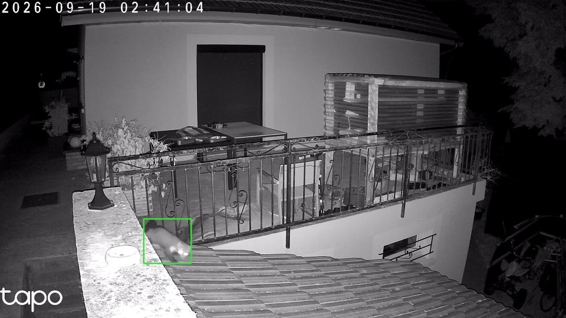

# How the animal detection works

Short version: every clip the camera records is downloaded, a few frames per second are run
through a wildlife detector on the GPU, the animal crop goes through a species classifier, and
the per-frame results are boiled down to one or two tags per clip. All of it happens on the
local machine.

```
camera SD card
   |  "download" stream request, about 10x realtime, one session at a time
   v
MP4 on disk (H.264 copied as is, audio to AAC)
   |  ffmpeg decodes on the CPU: 4 fps for the first 12 s, 2 fps after, scaled to 1920x1080
   v
DeepFaune detector on the GPU: YOLOv8s at 960 px, MegaDetector "sorrel" as a backstop
   |  classes: animal / person / vehicle, best box per frame
   v
DeepFaune classifier on the GPU: ViT-L (DINOv3), 224 px square crop of the animal
   |  40 European species, softmax score
   v
per clip: cluster the boxes, drop what never moves, keep labels seen on 2+ frames,
          pick the best frame and draw the box on it
   v
SQLite (one row per clip) + one JPEG per clip with an animal  ->  the web UI only reads these
```

## Why these choices

**Dense sampling at the start.** On a motion triggered clip the animal is what started the
recording, and a marten is often out of frame three seconds later. At 1 fps you get one or two
blurry frames, at 4 fps you get a dozen. After 12 seconds 2 fps is plenty.

**Decode on the CPU, infer on the GPU.** A one minute 2304x1296 clip decodes in about 2 seconds
on a laptop CPU, so NVDEC brings nothing. The GPU is kept for the two networks.

**FP32.** The card here is a GTX 1050 (Pascal). It has no fast FP16 path, half precision is
actually slower on it, so everything runs in FP32. PyTorch 2.14 with the CUDA 12.6 wheels is the
last prebuilt combination that still ships kernels for Pascal, the setup script pins it.

**Static box filter.** Boxes are grouped by position (3 % of the frame width). A group that shows
up in 6 frames or more is something that does not move. It is dropped, unless the classifier is
confident on most of those frames (median score 0.9 or more). That rule removes the dark corner
of my driveway that was a "bird" every night, and keeps the cat that sits on the wall for a
full minute.

**Plausibility list.** The classifier knows bison and wolverines. My terrace does not. Labels
outside a short list of species that can realistically show up in a garden around here fall
back to a generic "animal" tag.

**Two hits minimum.** A species seen on a single frame is almost always noise. A label needs at
least two frames and a top score of 0.8. When one species clearly dominates a clip, stray
secondary labels on the same track are dropped.

**Separate process.** The model runs in its own virtualenv and its own process, talks JSON lines
over stdin/stdout with the web app, runs at low priority, and exits after five idle minutes to
give the RAM and VRAM back.

## Numbers from my setup

Hardware: laptop, i7-8750H, 8 GB RAM seen by WSL2, GTX 1050 4 GB, camera on so-so outdoor Wi-Fi.

| | |
|---|---|
| download of a 66 s clip from the camera | 6.9 s (about 10x realtime) |
| playback starts after | 2 to 3 s, while the rest is still downloading |
| frames analysed per clip | about 130 for a 65 s clip |
| analysis time per clip, GPU | 15.8 s on average over 697 clips |
| detector alone, 960 px, GTX 1050, FP32 | about 40 ms per frame |
| model load time | about 11 s, once, then it stays resident |
| VRAM in use | between 2 and 2.5 GB |
| full day of recordings (about 70 clips) | under 20 minutes of GPU time |

What came out of the first 697 clips (ten days, one camera, terrace and driveway):

| tag | clips |
|---|---|
| nothing | 418 |
| dog (ours) | 180 |
| person | 141 |
| cat | 22 |
| vehicle | 15 |
| marten / mustelid | 5 |
| unidentified animal | 4 |
| fox | 1 |
| squirrel | 1 |
| bird | 1 |

So 60 % of what the camera records is wind and shadows, and the five clips I actually cared
about were buried in seven hundred.

How good is it? I have no proper benchmark, only a hand check on 41 clips I had watched myself:
all 6 cat visits found, both marten visits found (score 0.99 and 1.00, in infrared, animal
roughly 200 px wide in a 2304 px frame), the dog clips right. Before the static and plausibility
filters a good part of those clips carried a bogus extra tag (bird, cow, genet, wild boar). The
ones I rechecked after adding the filters came out clean. It will certainly still be wrong now and then, but it is wrong rarely enough that the
Animals tab is the first thing I open in the morning.


